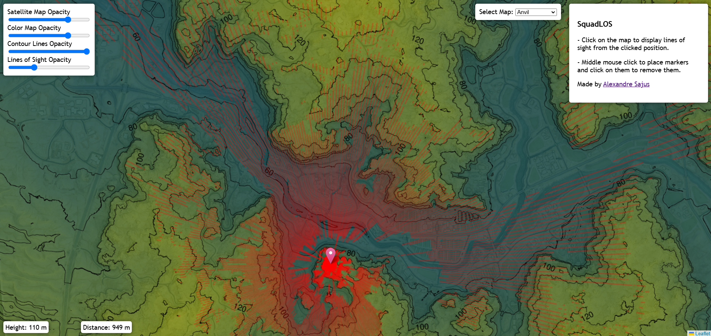
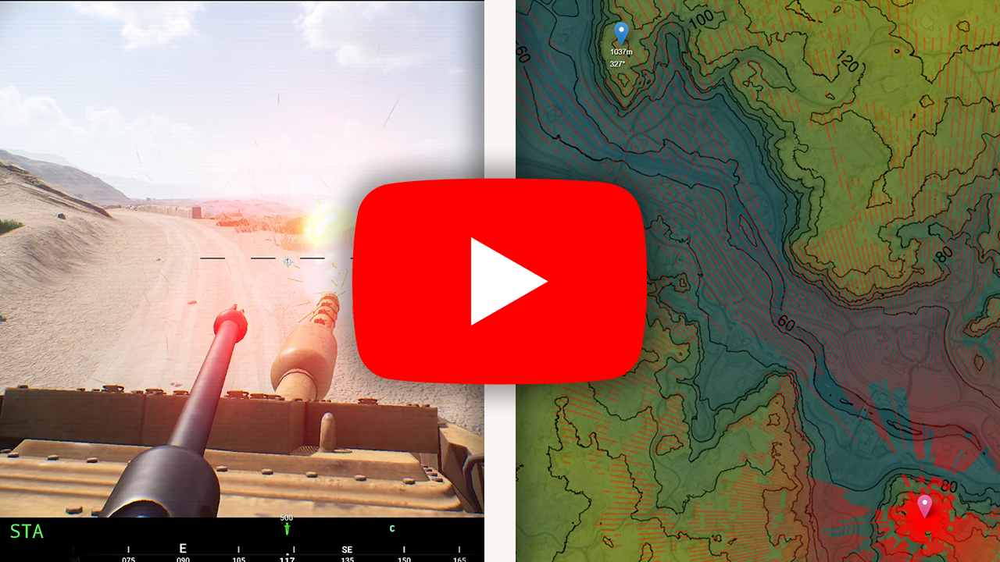

# SquadLOS

A website that provides topographic maps for Squad and line of sight calculations: [squadlos.com](https://squadlos.com/)

  

Data used in this project is available [here](https://www.kaggle.com/datasets/alexandresajus/squadtopography). It was sourced from this [GitLab repository](https://gitlab.com/squadstrat/squadmortar)

## Video Demo

  

